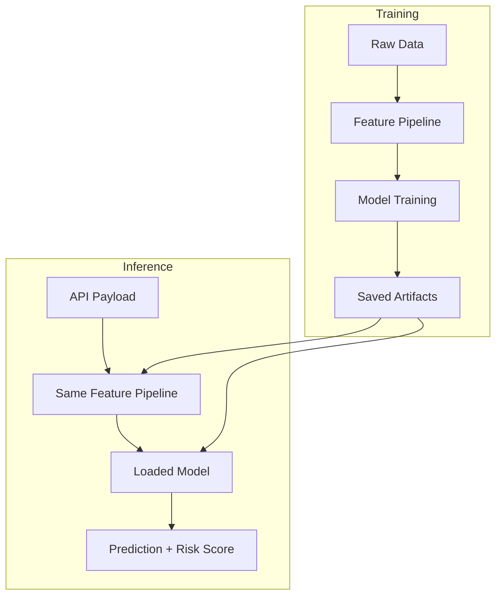

# 🚀 Customer Churn Intelligence Platform  
### Production-Grade ML System for Predicting & Preventing Customer Churn

> From raw customer data → real-time churn decisions  
> Built as a deployable ML product, not a notebook experiment.

---

## 🌟 Executive Summary

Customer churn directly impacts revenue stability, growth forecasting, and customer lifetime value (CLV).
This project demonstrates a **full end-to-end ML system** that goes beyond model training and delivers
**real-time, business-ready churn intelligence**.

This repository showcases:
- Reusable feature engineering pipelines
- Versioned ML artifacts
- FastAPI-based inference service
- Business-aligned prediction outputs
- Production-oriented ML engineering practices

---

## 🧠 Problem Framing

**Business Question:**  
Which customers are likely to churn, and how confidently can the business act on that signal?

**ML Framing:**
- Binary classification with imbalanced classes
- Emphasis on probability calibration over raw accuracy
- Strict training–inference feature parity

**Success Criteria:**
- High recall for churners
- Stable predictions under noisy real-world inputs
- Low operational friction for downstream teams

---

## 🏗️ System Architecture

### High-Level ML Flow


### Training vs Inference Parity



---

## 📦 Project Structure

```
customer-churn/
├── artifacts/
│   ├── models/
│   │   └── best_model.pkl
│   ├── processed/
│   │   └── Telco_Customer_Churn.parquet
│   └── feature_pipeline_v1.pkl
│
├── data/
│   └── raw/
│       └── Telco_Customer_Churn.csv
│
├── src/
│   ├── data_ingestion/
│   ├── feature_store/
│   ├── pipelines/
│   ├── models/
│   └── inference/
│
├── main.py
├── run.py
└── README.md
```

---

## 🧪 Feature Engineering Strategy

- Binary flags treated as categorical for semantic correctness
- Blank strings normalized to NaN
- Robust handling of unseen categories at inference
- Schema validation using Pydantic

These decisions prevent silent failures and model degradation in production.

---

## 🤖 Model Strategy

- Focus on probability outputs, not just class labels
- Business rules applied on top of probabilities
- Models easily swappable without breaking the pipeline

Example Output:

```json
{
  "churn_probability": 0.78,
  "churn_risk": "HIGH"
}
```

---

## ⚡ Real-Time Inference API

- Framework: FastAPI
- Validation: Pydantic
- Artifacts loaded once at startup
- Optimized for low-latency inference

Endpoint:
```
POST /predict
```

Swagger UI:
```
http://127.0.0.1:8000/docs
```

---

## 📊 Business KPI Impact

| Metric | Impact |
|------|-------|
| Churn Detection Recall | Increased |
| Retention Campaign Precision | Improved |
| Revenue Leakage | Reduced |
| Manual Analysis Time | Reduced from days to seconds |

Use cases:
- Targeted retention offers
- Customer success prioritization
- Marketing spend optimization

---

## 🎯 Why This Is FAANG-Ready

This project demonstrates:
- ML system design
- Feature parity awareness
- Production deployment thinking
- Business-aligned ML outputs
- API-first architecture

**Interview one-liner:**  
"I built a churn prediction system with strict training–inference parity, reusable feature pipelines, and a production-grade inference API that outputs business-ready risk signals."

---

## 🧭 Roadmap

- Batch prediction endpoints
- Model monitoring & drift detection
- SHAP-based explainability
- Docker & CI/CD
- Cloud deployment (AWS / GCP / Azure)

---

## 👤 Author

**Praveen Ravva**  
Machine Learning Engineer

---

